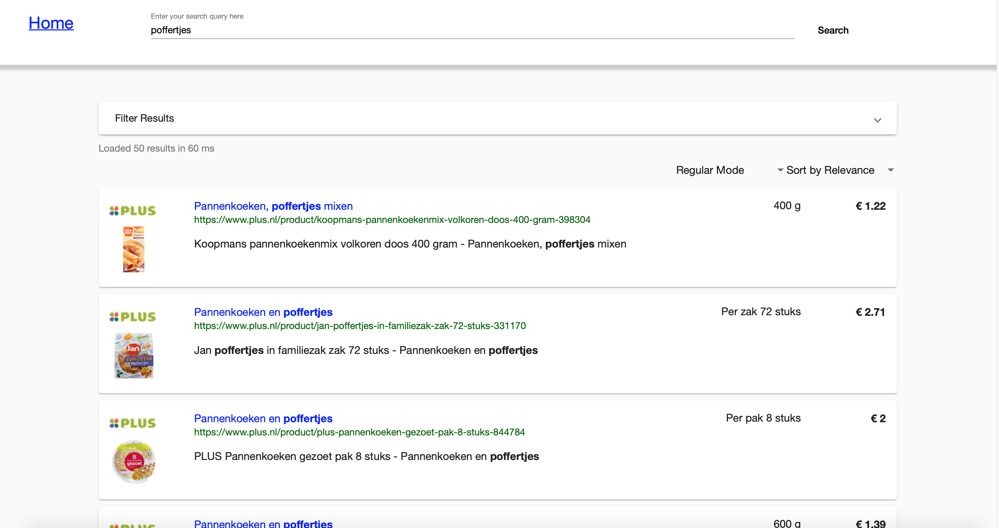
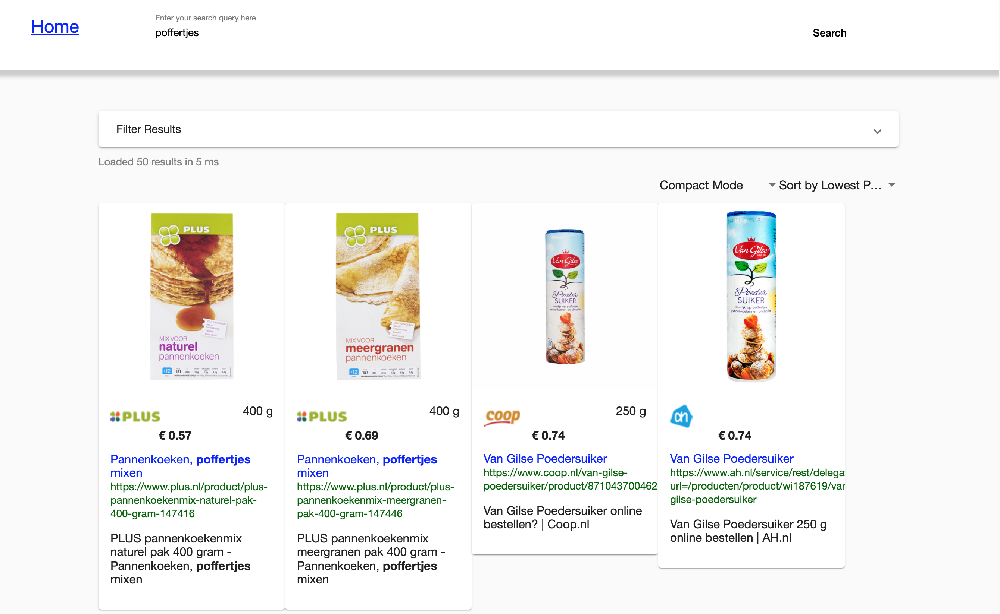
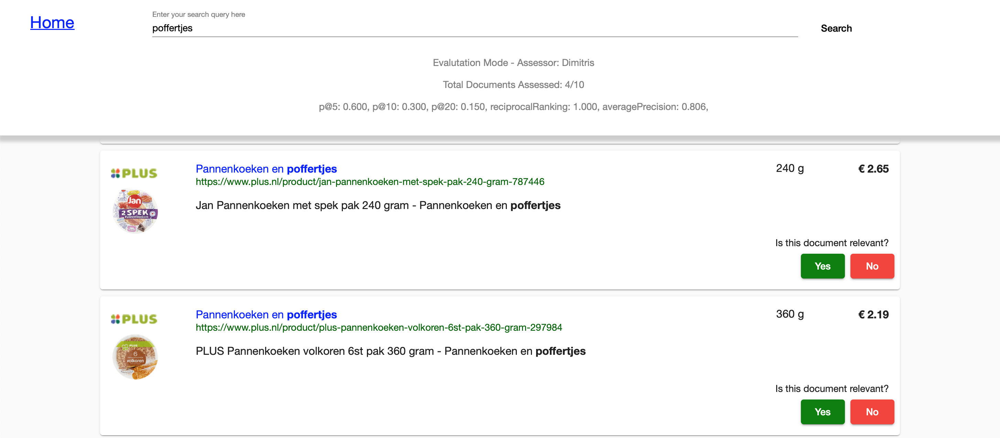

# GroceryBot

Grocerybot is a Dutch Supermarket Grocery search engine that crawls, indexes and retrieves more than 65000 products across 5 supermarket chains in the country, including AH, Jumbo, Plus, Coop and Vomar.

## Features
- Search through more than 65000 products across 5 supermarket chains.
- Parallel, multi-threaded crawling and indexing scripts.
- Search metadata, term highlighting, spell checking.
- Regular and Compacy view modes.
- Sort by price.
- Filter by weight/quantity.
- Query translation from English to Dutch
- Interactive evaluation interface with instant metrics calculator 

## Technology Stack
- Crawler, Indexer: ScraPy/Python.
- Backend: Elasticsearch/Python.
- Frontend: Angular 7.

## Screenshots

Grocerybot results interface(regular mode):

Grocerybot results interface(compact mode):

Grocerybot instant evaluation interface:

